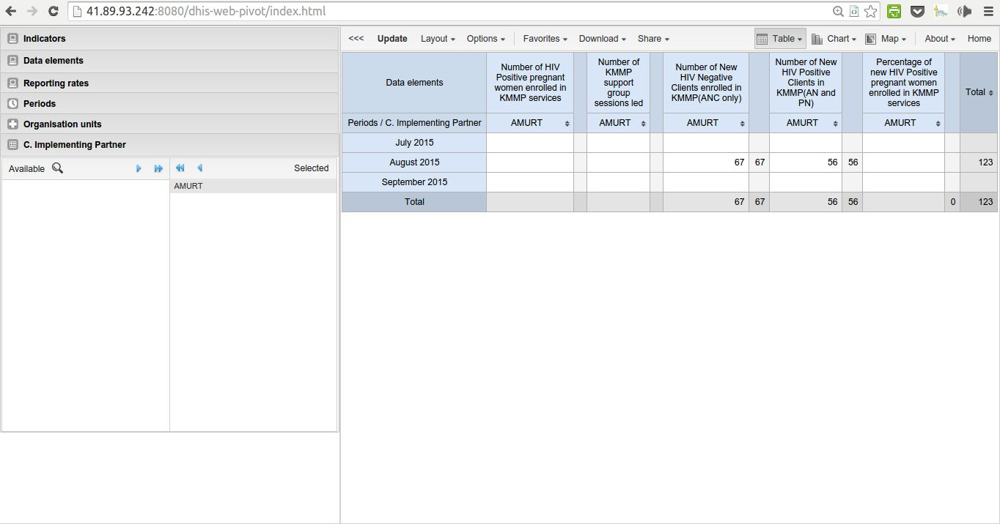

Data Access, Data Analysis and Reports
=======================================
Data Access Hierarchy Design
-----------------------------
This is based on the hierarchy: 

.. figure::  _static/hierarchy.png
   :align:   center

Fig 19 -Reporting structure

    1. An implementing partner E.g. AMURT can only access their own data
    2. An implementing agency E.g. USAID can access data for all their member  implementing partners.
    3. A donor E.g. PEPFAR can see data for all their member agencies and Implementing partners.

The following Additional analysis dimensions have been provided in the JPRP portal for both Pivot table and Visualizer. The visibility of these dimensions will vary from one user log in to another depending on the assigned privileges. For example, AMURT, an implementing partner will only see the Implementing partners’ dimensions and only AMURT option under the same.

    1. Implementing partners.
    2. Implementing agencies.
    3. Donors.

Fig 20. Pivot Table Analysis.
