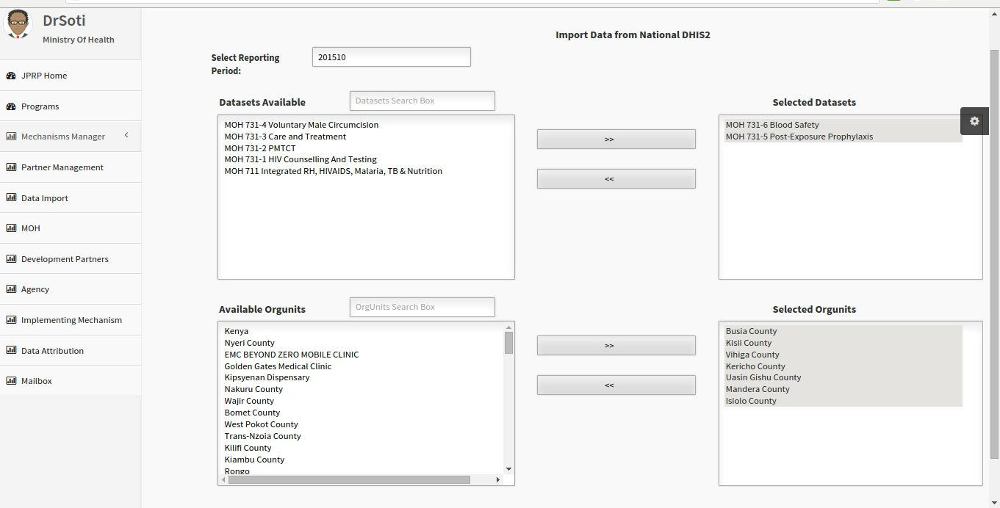

Data Import
===========
Data Import from the national DHIS2 instance
---------------------------------------------
To import data from DHIS2 live click on the **Data Import** button on the left menu. Then on the data import page select the period, the data elements and lastly the organization units. It will perform the import then show a data import statistics of the data elements that have been successfully imported and the ones that failed.

Fig 11 -Data Import Page.

.. figure::  _static/importstatistics.png
   :align:   center

Fig 12 -Data Import Statistics Page.

