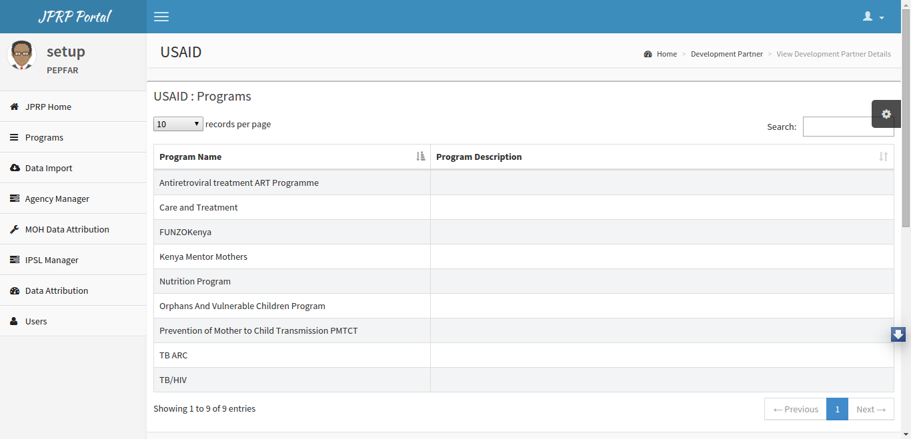

Hierarchy 
==========
MoH Level
------------
Create, update, and view development partners using the Donor Manager tab on the left menu.

List of Development Partners
+++++++++++++++++++++++++++++

Fig -list of development partners.

.. note:: To display the pop-out menu(with options e.g update and view) click on a specific development partner in the list.

Add Development Partner
+++++++++++++++++++++++++

Fig -Adding a development partner.

.. note:: Must provide programs supported by the donor and credentials of the administrator -(donor organization).

Update Development Partner
+++++++++++++++++++++++++++

Fig -Updating a development partner.

Development Partner Details
++++++++++++++++++++++++++++
Can view programs allocated to the donor and its agencies.

Fig -Viewing development partner details.

.. note:: User can drill down the hierarchy.

Development Partner Level
--------------------------
Create, update, and view agencies using the Agency Manager tab on the left menu.

List of Agencies
+++++++++++++++++

Fig -list of agencies.

.. note:: To display the pop-out menu(with options e.g update and view) click on a specific agency in the list.

Add Agency
++++++++++++

Fig -Adding an agency

.. note:: Must provide programs supported by the agency and credentials of the administrator -(agency organization).

Update Agency
++++++++++++++++

Fig -Updating an agency.

Agency Details
+++++++++++++++++

Can view programs allocated to the agency and its implementing mechanisms.

Fig -Viewing agency detials.

.. note:: User can drill down the hierarchy.

Agency Level
--------------
Create, update, and view mechanisms using the Mechanism Manager tab on the left menu.

List of Mechanisms
+++++++++++++++++++

Fig -list of Mechanisms.

.. note:: To display the pop-out menu(with options e.g update and view) click on a specific mechanism in the list.

Add Mechanism
+++++++++++++++

Fig -Adding a Mechanism

.. note:: Must provide programs supported by the mechansism and credentials of the Chief of Party of the IM.

Update Mechanism
+++++++++++++++++++

Fig -Updating a mechanism.

Mechanism Details
+++++++++++++++++++
Can view programs allocated to the mechanism and the facilities supported.

Fig -Viewing Mechanism detials.

Mechanism Level
-------------------
On the Implementing Mechanism tab on the left menu.

Implementing Mechanism Details
+++++++++++++++++++++++++++++++

Fig -List of programs

Fig -Facilities supported.

