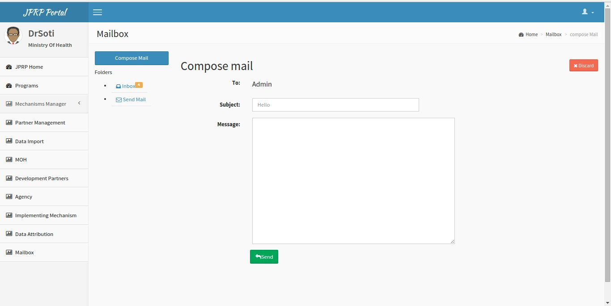
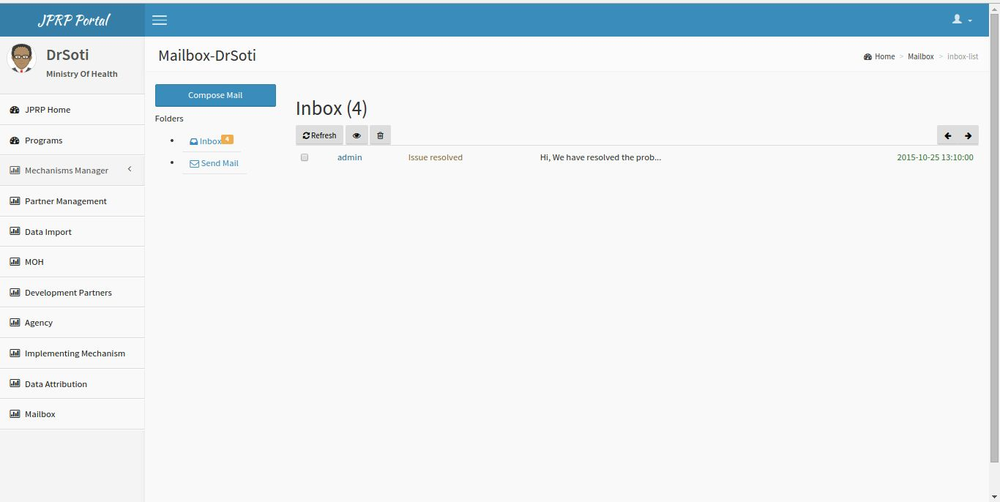
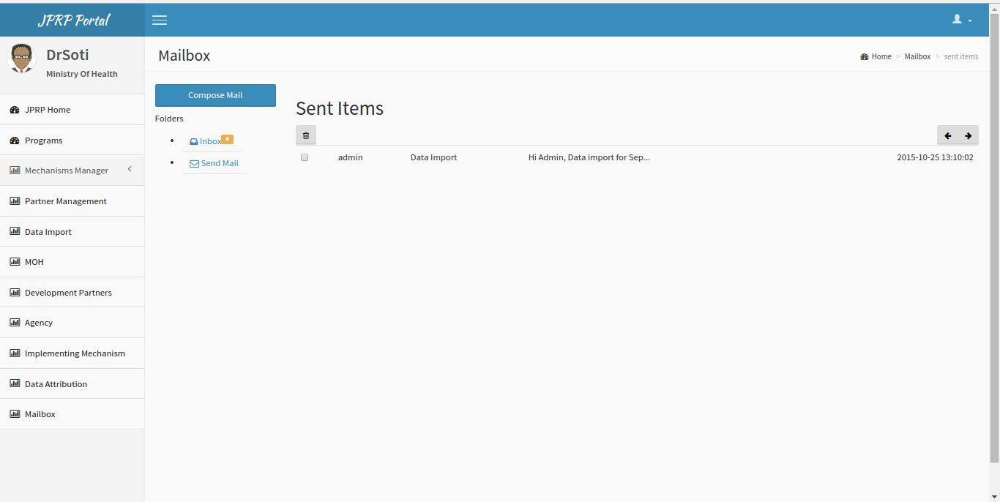
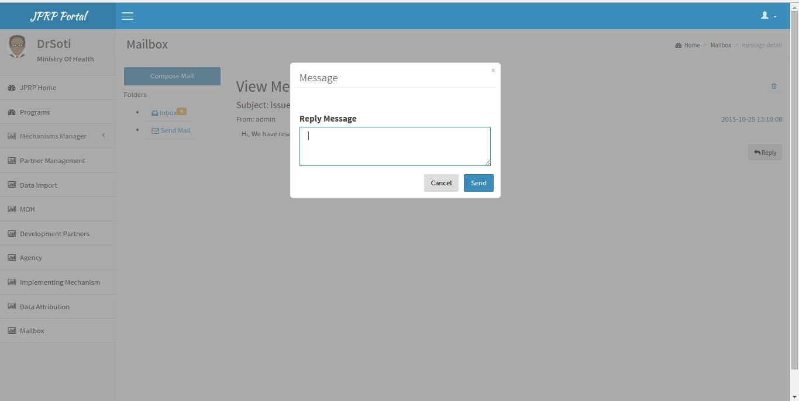

Mailbox 
========
It is a messaging service to report any problem in the system to the administrator.
The user can compose a new message, reply a previous message, and receive new messages.

Compose Mail
-------------

Fig 13.Compose New Message

Inbox 
------

Fig 14. Inbox Messages

Sent Messages
-------------

Fig 15. Sent Messages

Reply Message
--------------

Fig 16. Reply a Message