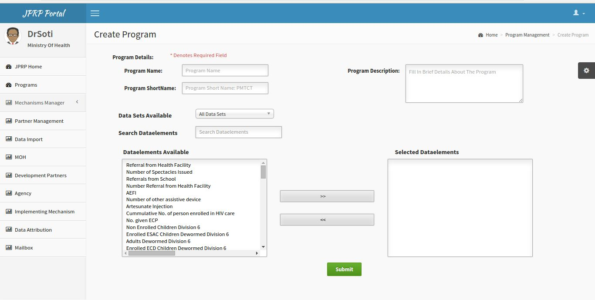
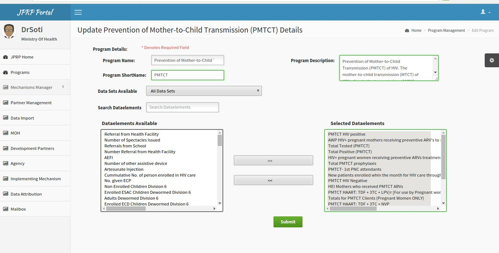
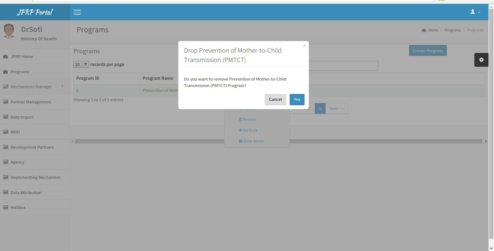
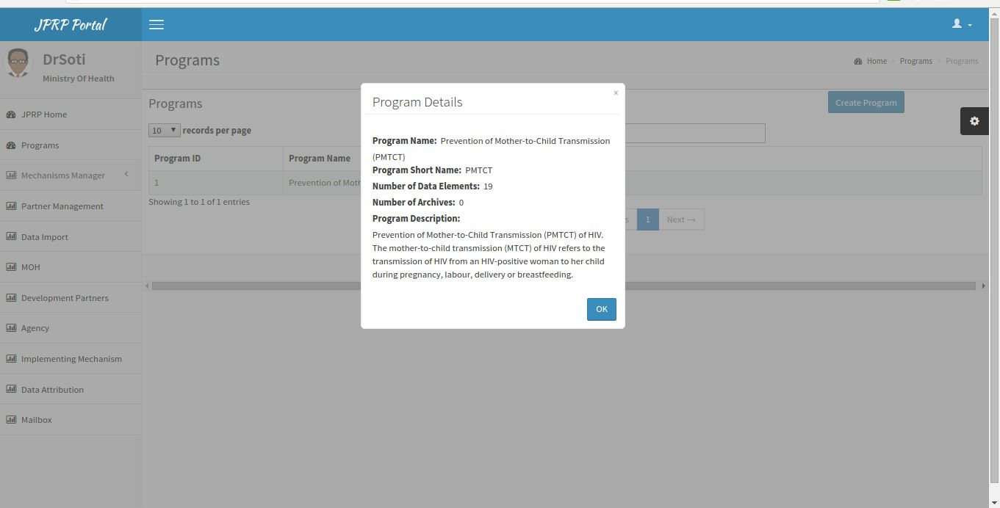
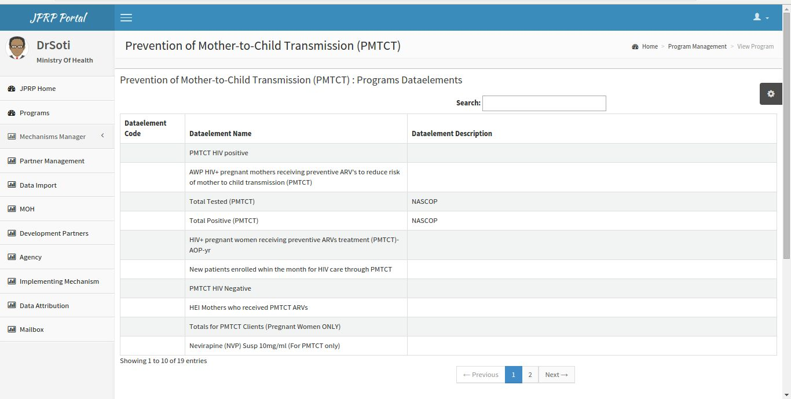
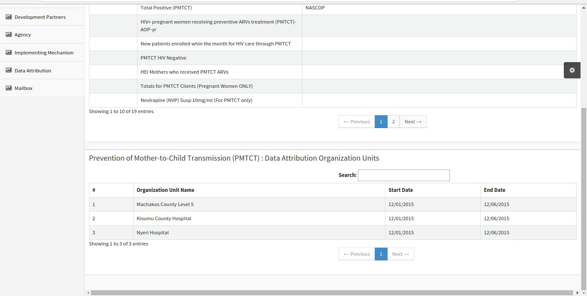

Programs
=========
Assigning Programs.
-------------------
After clicking on the programs tab the user with the required permissions can create, edit and remove programs.

View Program List.
-------------------
This page displays the programs already created. On clicking on a program item a **pop up menu** appears that allows the user to perform functions such as: 
- Show details of a program.
- Remove a program.
- Update a program.
- View program.

.. figure::  _static/program_list.png
   :align:   center

Fig 4-Pop-up menu on the program list.

Creating a Program
-------------------
To display the program creation page, click on the create program button on the program list page. During this process the user has to provide the program name, program short name, program description and select data elements for the program. 

Fig 5. -Create Program Page

Edit Program.
-------------
To display the program edit page, on the pop-up menu select edit. It allows the user to update details of the program such as the program name, short name, description and the data elements.

Fig 6.- Program Edit Page

Remove/Delete Program.
----------------------
On the program list page, click on the program you want to delete. On the pop up menu that appears select Remove. A dialog box appears and asks you to confirm or cancel the process. If you confirm the program will be delete.

.. note:: A program assigned to either donors, development partners, agencies and implementing partners cannot be deleted unless unassigned.

Fig 7. Confirmation to remove a Program.

Show Program Details.
---------------------
On the pop-up menu, select show details option to display program details. It shows summary details of the program such as number of data elements, program description and number of archives.

Fig 8. Show Program Details.

View Program 
------------
On selecting the view option on the pop-up menu. It displays the data elements assigned to the program and the facilities supporting the program.

Fig 9. Data elements of the Program.

Fig 10. Facilities supporting the program.