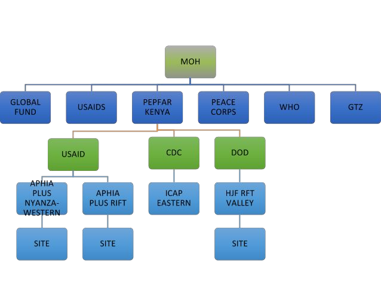
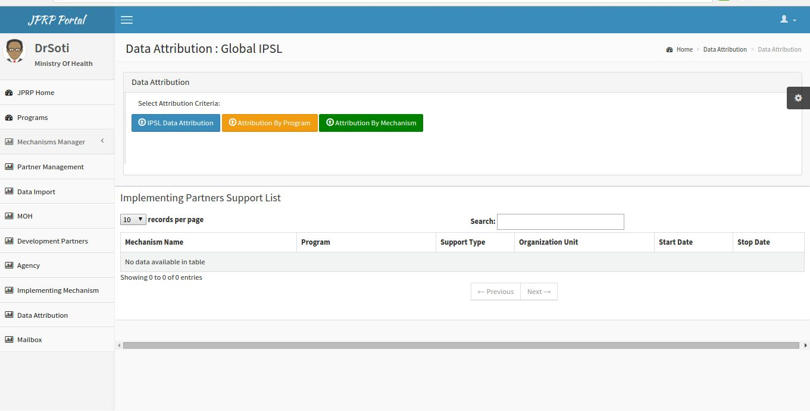

Program Reporting Structure and Attribution
============================================
PEPFAR Program Reporting Structure
-----------------------------------

.. _hierarchy:

Fig 17 -Reporting structure

Data Attribution
------------------
The attribution process can be summarized using the following diagram,

.. figure::  _static/attribution_process.png
   :align:   center

Fig 18 -Attribution Process
Attribution is performed by either IPSL, Mechanism or Program. 
After selecting the respective IPSL option data will be attributed accordingly as per the IPSL and the attribution results will be visible when performing Pivot table analysis.

Fig 18 -Attribution Page