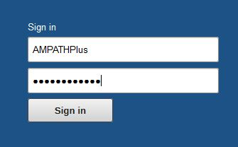
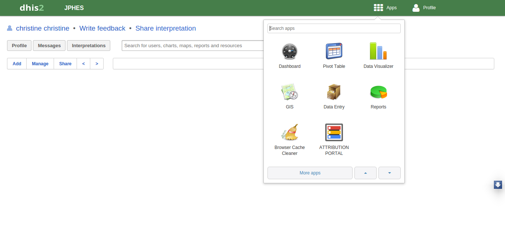
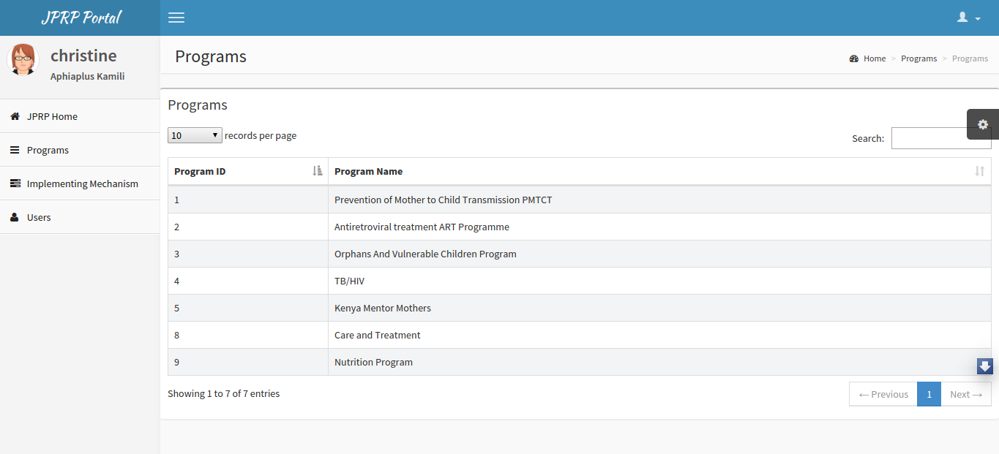
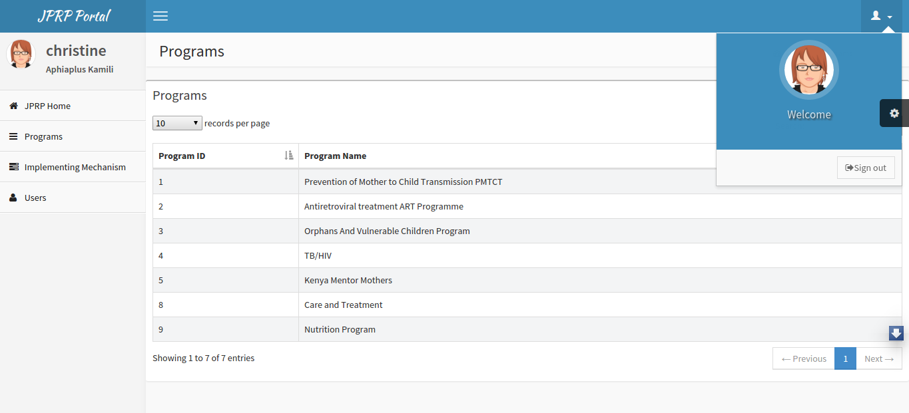

System
======

System Access
--------------
To access the application the user  has to login to PHES. Copy the link `PHES <http://41.89.93.235:8080>`_ into the browser URL and click go; the following log in screen appears where the user feeds in their provided username and password. The landing page of the application is the Dashboard.

.. _login_panel:

Fig 1.- PHES Login Page

Accessing the JPRP attribution portal app
+++++++++++++++++++++++++++++++++++++++++
Once logged into PHES, Click in the APPs Icon and select the attribution portal App. This depends on the PHES role allocated to the user .The attribution App uses the PHES login credentials and allocated privileges. 

.. _attribution_app:

Fig 1.- JPRP Attribution App

.. _jprp_landing_page:

Fig 1.- JPRP Landing page

.. note:: One cannot access the JPRP-APP without logging in to the `PHES <http://41.89.93.235:8080>`_ 

Logout- JPRP 
+++++++++++++++++++
To logout, click on either JPRP Home tab or on the sign out button in the profile icon.

.. _sign_out:

Fig 1.- Logging Out of JPRP

Main Functions
------------------

What the user can do on the attribution portal app
++++++++++++++++++++++++++++++++++++++++++++++++++
* Create/delete/update/view  programs. 
* Create/update/view Support  programs.
* Create/update/view support agencies.
* Create/update/view users within a certain level e.g mechanism, agency or donor levels.
* Create/update/view jprp user roles within a certain level.
* Import the Partner IPSL.
* Pull Data from the National DHIS2.
* Perform data sharing/attribution.

What the user cannot do using the attribution portal App
++++++++++++++++++++++++++++++++++++++++++++++++++++++++
* Reports (standard reports), Data Visuals, data entry and pivot tables analysis  – done in PHES.

JPRP Hierarchy
----------------

MOH(Ministry of Health)-Top Level
++++++++++++++++++++++++++++++++++
* Create, Update and Remove Programs.
* Create, Update and Remove Development Partners e.g PEPFAR.
* Assign Programs to a Development Partner.
* View a list of the development partners.
* View details of each development partner such as the programs assigned and the agencies supported by the development partner.In addition, can drill down to the lowest level(mechansim).
* Attributes the data either by mechanism, IPSL or mechanism.
* Create, View and Update JPRP user roles based on authorities at this level.
* Create a default Development partner Admin.
* Create, view and update users for this specific level.

Development Partner Level
++++++++++++++++++++++++++

* Create, Update and Remove agencies.
* View a list of the agencies.
* View details of each agency: the programs assigned to the agency and the Implementing mechanisms the agency is supporting.
* Create, View and Update JPRP user roles based on authorities at this level.
* Create a default Agency Admin.
* Create, view and update users for this specific level.

Agency Level
+++++++++++++

* Create, Update and Remove Implementing Mechanism.
* Assign programs to an Implementing mechanism.
* View the list of the Implementing mechanisms.
* View details of each IM: the programs supported and the facilities under the Implementing Mechanism.
* Create, View and Update JPRP user roles based on authorities at this level.
* Create a default Implementing Mechanism Admin.
* Create, view and update users for this specific level.

Implementing Mechanism Level
+++++++++++++++++++++++++++++
* View a list of all facilities supported by the Implementing mechanism.
* View a list of the programs supported by the IM.
* Create, View and Update JPRP user roles based on authorities at this level.
* Create a default Implementing Mechanism Admin.
* Create, view and update users for this specific level.

