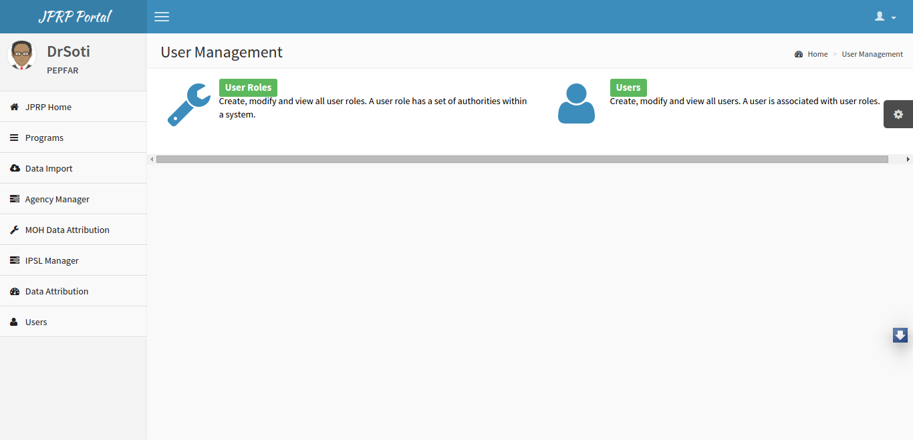
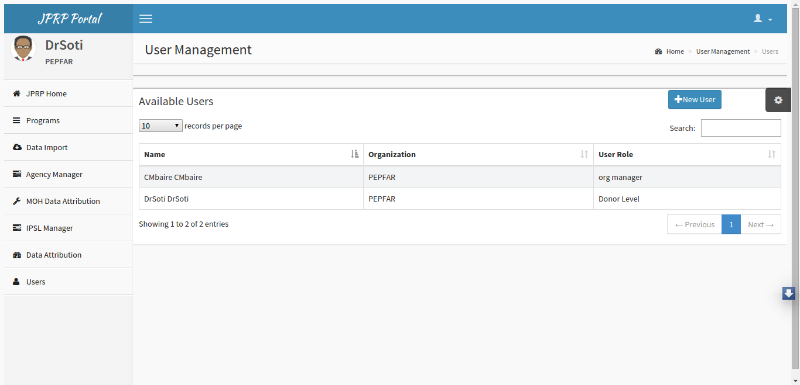
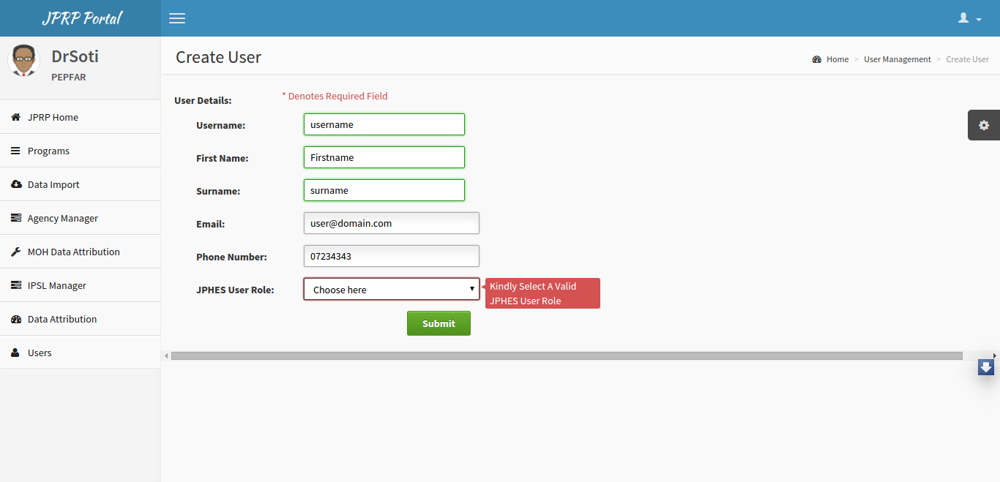
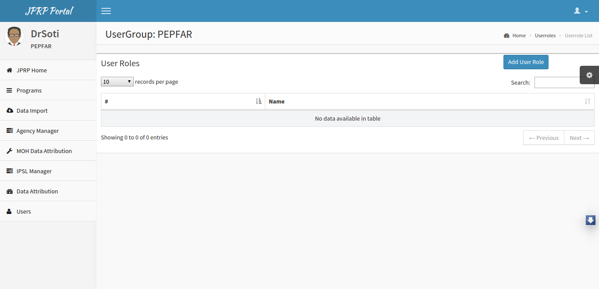
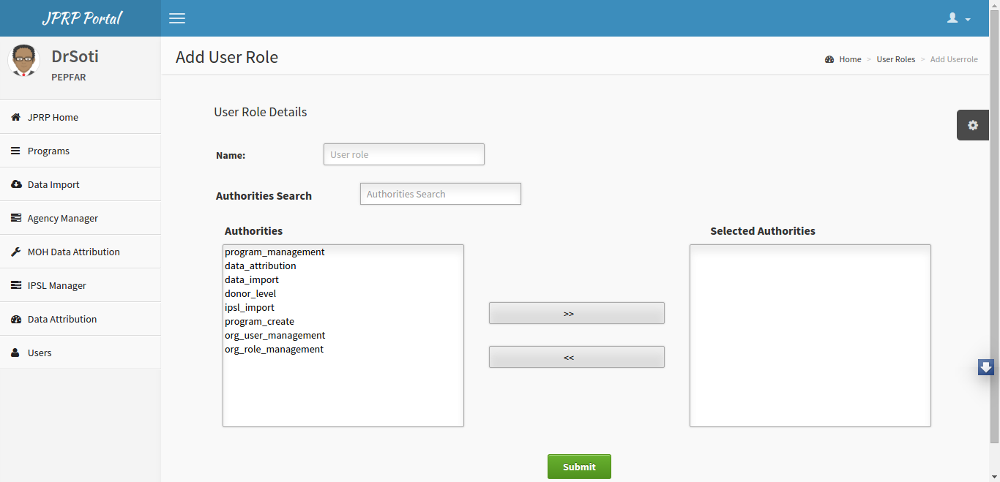

User Management
================
Users and User Roles
----------------------
All users in the system will be created using the User Management Module in JPRP.

Creating Users
+++++++++++++++
- Administrators have the responisibility of creating users at their respective levels.
- When creating users they will have to provide the user with a DHIS2 user role which is already predefined.
- In addition, they will provide the user with a JPRP user role. 

.. note:: For the JPRP user roles the administrators will have to create them based on their organization.

**How to create a user**

- Click on the users tab on the left menu 
- On the user management dashboard that appears click on the users icon.
- It displays a list of the  users with their different roles. On the right side, click on the button "new user"
- Provide the details of the user(username, first name, surname, phone number, email address, DHIS2 user role and JPHES user role).
- Then click on the submit button.

Fig -User Management Dashboard.

Fig - List of Users

Fig -Add User.

Creating User Roles
++++++++++++++++++++
- Click on the users tab on the left menu.
- On the user management dashboard that appears click on the user roles icon.
- It displays a list of the  users roles with their different authorities. On the right side, click on the button "Add User Role"
- Provide a name of the user role and select the relevant authorities of the user role. Then click on the submit button.

- Other options-A user can update the selected authorities and the user role name.

Fig -User Management Dashboard.

Fig -List of user roles.

Fig -Add User Role.

DHIS2 User Roles
-----------------
Development Partner Level
++++++++++++++++++++++++++++
- Donor Admin

Agency Level
++++++++++++++++++++++++++++
- Agency User
- Agency Admin

Mechanism Level
++++++++++++++++++++++++++++
- Implementing Partner Admin
- Implementing Partner User

JPRP User Authorities
----------------------

Development Partner Level
++++++++++++++++++++++++++++
- Program Management- View all programs
- Org User Management - Create JPRP users
- Org Role Management - Create JPRP user roles
- IPSL Import - Can Import the IPSL
- Data Attribution -Can perform Data Attribution.
- Program Create -Can create,update and remove programs.
- Donor Level

Agency Level
++++++++++++++++++++++++++++
- Program Management
- Org User Management
- Org Role Management
- IPSL Import
- Agency Level

Mechanism Level
+++++++++++++++++++++++++++
- Program Management
- Org User Management
- Org Role Management
- Mechanism Level

