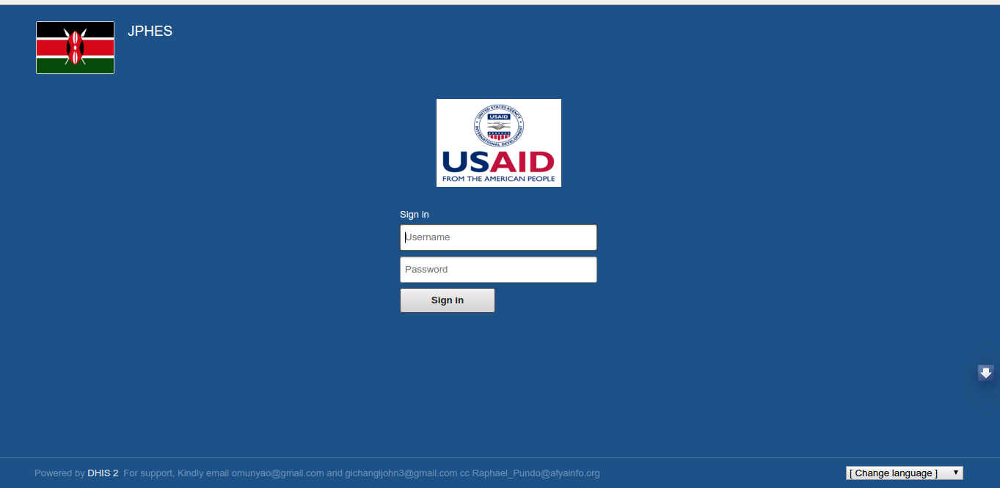

Users
=====
How to create users
--------------------
The portal administrator using the DHIS2   application   functionalities   will   create   Donor,   Agency  
and Implementing Partner users and grant them appropriate group and rights such as  
authorizing access to data sets for partners. 

For example, an account for implementing partners under **AMPATHplus** can be created and given privileges required by the Implementing Partners. This can be illustrated on fig. 1 below

.. _login_page:

Fig. 2 – Example - Logging in as AMPATHplus user
 
After this User has been created, the account will be availed to a lead user from the respective organization who will customize it to their own taste. This authorized user can then create other users under them, assign them to IP users within their organization, and add them to their own user group for ease of sharing facilities and data elements.
This user will be responsible of maintaining users (de-registering and approving new user accounts) for their respective organization.

For the case of funding agency users, the portal admin will allocate the respective account to an approved agency who will take charge of the account. From this account, one can create new Implementing Partner organization under them and approve IP user accounts under the organization. The agency can also remove an IP group from the list of IPs funded by this agency.

How partners are assigned support facilities.
---------------------------------------------
The administrator is in charge of uploading the **IPSL** (contains the facilities and their mechanisms) it automatically allocates the facilities to their respective mechanisms once uploaded.

.. _ipsl:

Fig. 3 – Mechanism Support Import

